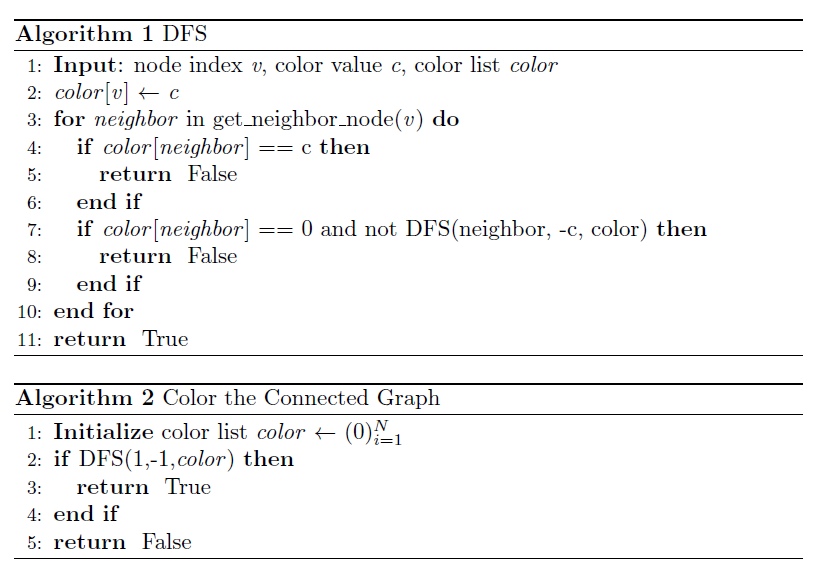
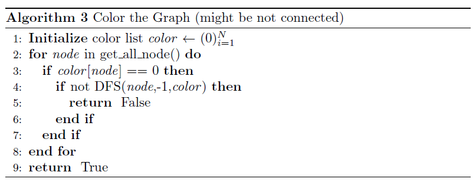
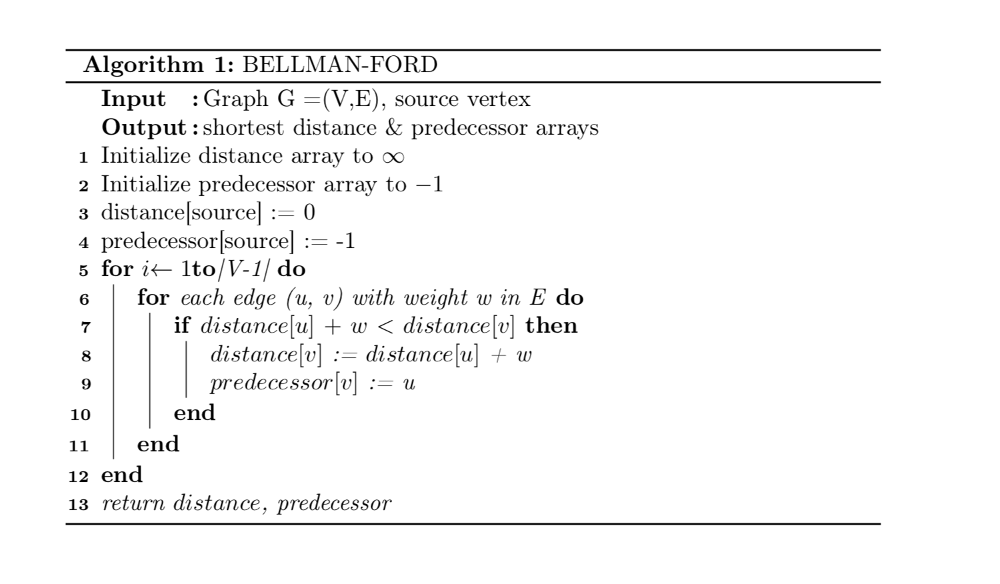

## Homework1

> name: 陈文浩
>
> id: 519030910217

### Problem1

1. The components are as follows

   - Actions: place k-th (0<=k<8) queen on an empty position of chessboard
   - Successor: update arrangements of queens and place (k+1)-th queen if k + 1 < 8
   - Goal test: if k=8 and no two queens are in the same row, column, or diagonal

   As the k-th (0<=k<8) queen has (64-k) possible locations, the amount of states is:
   $$
   \frac{64!}{56!}
   $$
   If we count the intermediate states, the answer is:
   $$
   \sum_{i=0}^{8}\frac{64!}{(64-i)!}=1 + 64+64\times 63 +\cdots+\frac{64!}{56!}
   $$
   
   
2. Note that there are 8 rows, 8 queens and that no two queens shares a row.  

   Thus, we can use `r[i]=j` to represent that queen in row i is at column j.

   And we can formulate the state space as the set of all arrangements of array `r`.

   The components are as follows:

   - Action: set value of `r[i]`
   - Successor: update value of `r[i]` and arrange `r[i+1]` if i + 1 < 8
   - Goal test: if i=8 and no two queens are in the same column or diagonal

   The amount of states is:
   $$
   8^8
   $$

   Again, if we count the intermediate states, the answer is:
   $$
   \sum_{i=0}^{8}8^i=1+ 8+8^2+\cdots+8^8
   $$
   

### Problem2

1. > Start - p - d - b - e - a - r -  f - c - Goal

2. 10 nodes in total. (If Goal is counted, otherwise 9 nodes.)

3. > Start - d - e - r - f - Goal

4. The length is 5.

5. The cost is 11.

### Problem3

1. N, Y, N
2. Properties
   - If the graph has a cycle with odd number of vertices, then it can not be colored with 2 colors.
   - If the graph is bipartite, it can be colored with 2 colors.
3. 
4. 

### Problem4

1. As Dijkstra's algorithm applies on graph search, here I consider UCS as <u>Uniform cost graph search</u>.

   Dijkstra's algorithm is single source shortest path (SSSP) algorithm.

   The differences are:

   - UCS intends to find paths and Dijkstra's algorithm only cares the shortest distance.

   - Node in UCS represents a path, but in Dijkstra's algorithm it only records the shortest distance.

   - UCS terminates when expanding goal. However, Dijkstra's algorithm terminates when all connected nodes are visited.

2. No. UCS yields `Start - B - Goal`. However, `Start - A - Goal` is optimal.

   ```mermaid
   graph LR
   Start --->|10| A
   A --->|-10| Goal
   Start --->|1| B
   B --->|1| Goal
   
   ```

3. Bellman-Ford algorithm.

   Bellman-Ford algorithm uses dynamic programming to solve the SSSP problem and it can also be used to tell if the graph contains negative circle. It can be better illustrated by the following pseudo-code: 

   

   