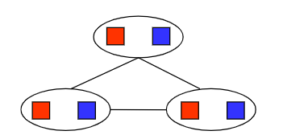
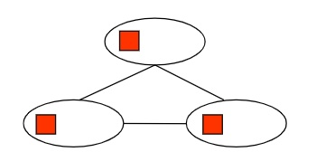

# Homework2

### Problem1

| Frontier | Explored set        |
| -------- | ------------------- |
| A        |                     |
| B, C, D  | A                   |
| C, D     | A, B                |
| C, E, F  | A, B, D             |
| C, F, G  | A, B, D, E          |
| F, G     | A, B, C, D, E       |
| G        | A, B, C, D, E, F    |
|          | A, B, C, D, E, F, G |


### Problem2

1. Rectilinear floor-planning

   Identification problem. We only care about the feasible layout of rectangles.

   **Variables**: $P_i=\{left,up\}$, position of rectangle i

   **Domains**: $\mathbb{R}^2$

   **Constraints**: non-overlapping with each other; all small rectangles are in large rectangle

2. Class scheduling

   Identification problem. We only care about the feasible assignments.

   **Variables**: $X_i=\{time,professor, class\}$

   **Domains**: $\text{time solts} \times \text{professor} \times \text{classes}$

   **Constraints**: professor can teach the class assigned to he/she; all classes are assigned; each professor can teach at most one class at a time; each classroom can only be assigned at most one class at a time.

3. Hamiltonian tour

   Identification problem. We only care about the tour assignment.

   **Variable**: $v_i$, the i-th visit city

   **Domains**: $v_i \in \text{cities}$

   **Constraints**: each city is visited and only visit once; there's road between $t_{i-1},t_i$
   
   

### Problem3

After each variable assignment, I do all the forwarding checking first, then cross off values.

**Notations**: 

- `Current Varible x: [y]`: current selected variable is `x` with assigned value `y`

- `x: [y]`: After forward checking with current selected variable, variable `x` has domain `y`

Final result is `X3: [1], F: [1], X2: [0], X1: [0], O: [4], T: [7], R: [8], U: [6], W: [3]`

Step by step details are as follows.

```
Current Variable X3: [0]
X3: [0]
F: [[]]
X2: [[0, 1]]
X1: [[0, 1]]
O: [[0, 1, 2, 3, 4, 5, 6, 7, 8, 9]]
T: [[0, 1, 2, 3, 4]]
R: [[0, 1, 2, 3, 4, 5, 6, 7, 8, 9]]
U: [[0, 1, 2, 3, 4, 5, 6, 7, 8, 9]]
W: [[0, 1, 2, 3, 4, 5, 6, 7, 8, 9]]

empty domain detected!

Current Variable X3: [1]
X3: [1]
F: [[1]]
X2: [[0, 1]]
X1: [[0, 1]]
O: [[0, 1, 2, 3, 4, 5, 6, 7, 8, 9]]
T: [[5, 6, 7, 8, 9]]
R: [[0, 1, 2, 3, 4, 5, 6, 7, 8, 9]]
U: [[0, 1, 2, 3, 4, 5, 6, 7, 8, 9]]
W: [[0, 1, 2, 3, 4, 5, 6, 7, 8, 9]]

Current Variable F: [1]
X3: [1]
F: [1]
X2: [[0, 1]]
X1: [[0, 1]]
O: [[0, 2, 3, 4, 5, 6, 7, 8, 9]]
T: [[5, 6, 7, 8, 9]]
R: [[0, 2, 3, 4, 5, 6, 7, 8, 9]]
U: [[0, 2, 3, 4, 5, 6, 7, 8, 9]]
W: [[0, 2, 3, 4, 5, 6, 7, 8, 9]]

Current Variable X2: [0]
X3: [1]
F: [1]
X2: [0]
X1: [[0, 1]]
O: [[0, 2, 4, 6, 8]]
T: [[5, 6, 7, 8, 9]]
R: [[0, 2, 3, 4, 5, 6, 7, 8, 9]]
U: [[0, 4, 5, 6, 7, 8, 9]]
W: [[0, 2, 3, 4]]

Current Variable X1: [0]
X3: [1]
F: [1]
X2: [0]
X1: [0]
O: [[0, 2, 4]]
T: [[5, 6, 7, 8, 9]]
R: [[0, 4, 8]]
U: [[0, 4, 6, 8]]
W: [[0, 2, 3, 4]]

Current Variable O: [0]
X3: [1]
F: [1]
X2: [0]
X1: [0]
O: [0]
T: [[5]]
R: [[]]
U: [[4, 6, 8]]
W: [[2, 3, 4]]

empty domain detected!

Current Variable O: [2]
X3: [1]
F: [1]
X2: [0]
X1: [0]
O: [2]
T: [[6]]
R: [[4]]
U: [[0, 4, 6, 8]]
W: [[0, 3, 4]]

Current Variable T: [6]
X3: [1]
F: [1]
X2: [0]
X1: [0]
O: [2]
T: [6]
R: [[4]]
U: [[0, 8]]
W: [[0, 3]]

Current Variable R: [4]
X3: [1]
F: [1]
X2: [0]
X1: [0]
O: [2]
T: [6]
R: [4]
U: [[0, 8]]
W: [[0, 3]]

Current Variable U: [0]
X3: [1]
F: [1]
X2: [0]
X1: [0]
O: [2]
T: [6]
R: [4]
U: [0]
W: [[]]

empty domain detected!

Current Variable U: [8]
X3: [1]
F: [1]
X2: [0]
X1: [0]
O: [2]
T: [6]
R: [4]
U: [8]
W: [[]]

empty domain detected!

Current Variable O: [4]
X3: [1]
F: [1]
X2: [0]
X1: [0]
O: [4]
T: [[7]]
R: [[8]]
U: [[0, 6, 8]]
W: [[0, 2, 3]]

Current Variable T: [7]
X3: [1]
F: [1]
X2: [0]
X1: [0]
O: [4]
T: [7]
R: [[8]]
U: [[0, 6]]
W: [[0, 2, 3]]

Current Variable R: [8]
X3: [1]
F: [1]
X2: [0]
X1: [0]
O: [4]
T: [7]
R: [8]
U: [[0, 6]]
W: [[0, 2, 3]]

Current Variable U: [0]
X3: [1]
F: [1]
X2: [0]
X1: [0]
O: [4]
T: [7]
R: [8]
U: [0]
W: [[]]

empty domain detected!

Current Variable U: [6]
X3: [1]
F: [1]
X2: [0]
X1: [0]
O: [4]
T: [7]
R: [8]
U: [6]
W: [[3]]

Current Variable W: [3]
X3: [1]
F: [1]
X2: [0]
X1: [0]
O: [4]
T: [7]
R: [8]
U: [6]
W: [3]

find solution!
```


### Problem4

**Notations**: 

- `Current Varible x: [y]`: current selected variable is `x` with assigned value `y`

- `x: [y]`: After AC3 with current selected variable, variable `x` has domain `y`
- `x: original domain [y], cross off result [z]`: original domain of variable `x` is `y` and after crossing off the new domain is `z`.
- `push xxx`: push arc to the queue
- `pop xxx`: pop arc from the queue

The final result is `A: [3], B: [2], C: [1], D: [3]`

Step by step details are as follows.

```
Current Variable A: [3]
AC3 start
push B --> A
pop B --> A
B: original domain [3, 2, 1], cross off result [2, 1]
push A --> B
push C --> B
pop A --> B
pop C --> B
C: original domain [3, 2, 1], cross off result [1]
push B --> C
push D --> C
pop B --> C
B: original domain [2, 1], cross off result [2]
push A --> B
push C --> B
pop D --> C
D: original domain [3, 2, 1], cross off result [3, 2]
push C --> D
pop A --> B
pop C --> B
pop C --> D
AC3 end
A: [3]
B: [[2]]
C: [[1]]
D: [[3, 2]]

Current Variable B: [2]
AC3 start
push A --> B
push C --> B
pop A --> B
pop C --> B
AC3 end
A: [3]
B: [2]
C: [[1]]
D: [[3, 2]]

Current Variable C: [1]
AC3 start
push B --> C
push D --> C
pop B --> C
pop D --> C
AC3 end
A: [3]
B: [2]
C: [1]
D: [[3, 2]]

Current Variable D: [3]
AC3 start
push C --> D
pop C --> D
AC3 end
A: [3]
B: [2]
C: [1]
D: [3]

find solution!
```


### Problem5

For subproblem (a), (b) and (c), I would like to give examples under Map Coloring problem.

1. 

   This graph is 2-consistency but not 3-consistency.

2. 

   This graph is 3-consistency but not 2-consistency.

3. Assign forward might fail with graph with cycles.

   Remove backward only ensures arc $parent(x_i)\rightarrow x_i$ consistency for each parent while it neglects the combination of all the parents. However, for every node in tree, it has at most 1 parent. 

   

   Assume the above figure indicates the result of Remove backward. Assign forward is surely to fail as the instance is unsatisfiable.

