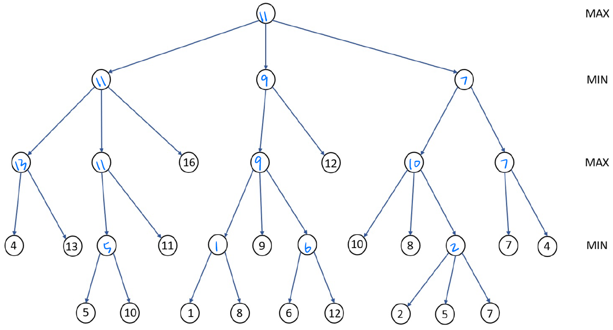
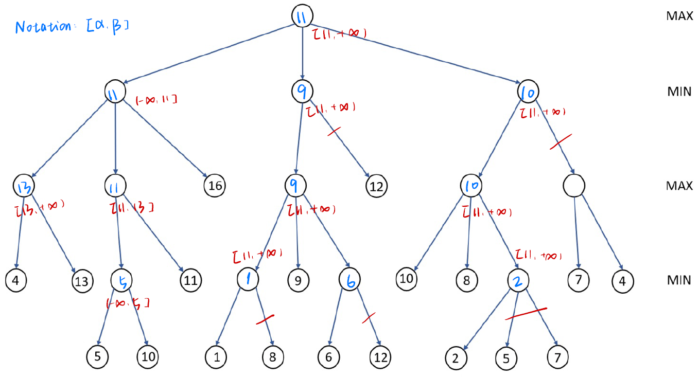

## Homework3

### Problem1

`state`: A sequence of cities indicating the order of visit.

`crossover`: 

1. Randomly choose city x. 
2. Assume the position of city x in the sequences are $p_l,p_r$, uniformly random $k\sim U(p_l,p_r)$​ as the new position of city x. 
3. Randomly choose a parent sequence and copy the rest cities.

For example, assume we choose city 1, generate k=2 ($k\sim U(1,4)$) and decide to copy from $S_1$
$$
S_1=1234,S_2=4321 \longrightarrow S=2134
$$
`mutation`: Randomly choose 2 cities and change their position

`fitness function`: 1 / (the cost of route)

### Problem2

First, we use mathematical induction to prove that values of every node in the game tree are transformed into $a\times value +b$

We first define $d(u)$ as the distance between node u and the deepest leaf node in the subtree of u.

**Basic steps**. For all leaf nodes, $a\cdot v+b$ holds.

**Induction hypothesis**. Assume for all nodes whose $d(u)\leq k$, the equation holds.

**Proof of induction step**. 

For node with $d(u)=k+1$. As all the values of u's children are transformed into $a\cdot v^\prime+b$, we can prove that the result of u is always $a\cdot v(u)+b$ for max, min and chance node.

Thus, values of every node in the game tree are transformed into $a\times value +b$.

Second, as $\arg \max v_i=\arg \max a\cdot v_i+b$, the choice of move remains unchanged.

### Problem3

### Problem4

As `Overheated` is terminal state and only contains negative reward, the best action in `Warm` state must be `Slow`. However, the best action of `Cool` state is not obvious and I test each of them.
$$
V^\star(w)=1 + 0.5\gamma (V^\star(w)+V^\star(c)) \\
V^\star(c)=2+0.5\gamma (V^\star(w)+V^\star(c)) \quad or \quad V^\star(c)=1+\gamma V^\star(c)
$$
The final result is 
$$
V^\star(c)=\frac{4-\gamma}{2-2\gamma}>\frac{1}{1-\gamma} \quad \quad V^\star(w)=\frac{2+\gamma}{2-2\gamma} \quad \quad V^\star(o)=0
$$

$$
Q^\star(c,f)=\frac{4-\gamma}{2-2\gamma} \\
Q^\star(c,s)=\frac{2+2\gamma-\gamma^2}{2-2\gamma} \\
Q^\star(w,f)=-10\\
Q^\star(w,s)=\frac{2+\gamma}{2-2\gamma}
$$

### Problem5

After k-th policy improvement, we have
$$
\pi'(s)=\arg\max Q_k(s,a) \\
V_k(s)=Q_k(s,\pi(s)) \leq Q_{k}(s,\pi'(s))
$$

$$
\begin{align}
V_k(s)\leq &Q_k(s,\pi'(s))= \sum_{s^{\prime}} T\left(s, \pi'(s), s^{\prime}\right)\left[R\left(s, \pi'(s), s^{\prime}\right)+\gamma V_k\left(s^{\prime}\right)\right] \\
\leq &\sum_{s^{\prime}} T\left(s, \pi'(s), s^{\prime}\right)\left[R\left(s, \pi'(s), s^{\prime}\right)+\gamma Q_k(s',\pi'(s'))\right] \\
=&\sum_{s^{\prime}} T\left(s, \pi'(s), s^{\prime}\right)\left[R\left(s, \pi'(s), s^{\prime}\right)+\gamma \sum_{s^{\prime \prime}} T\left(s^\prime, \pi'(s'), s^{\prime \prime}\right)\left[R\left(s^\prime, \pi'(s'), s^{\prime \prime}\right)+\gamma V_k\left(s^{\prime \prime}\right)\right]\right] \\
\leq & \cdots = V_{k+1}(s)
\end{align}
$$

As each $V(s)$ has a upper bound, $V(s)$ must converge.

When $V_k(s)=V_{k+1}(s)$, we have 
$$
V(s)=Q(s,\pi '(s))=\max Q (s,a)
$$
Thus, the Bellman optimal equation is satisfied and $\pi=\pi ^\star$.
