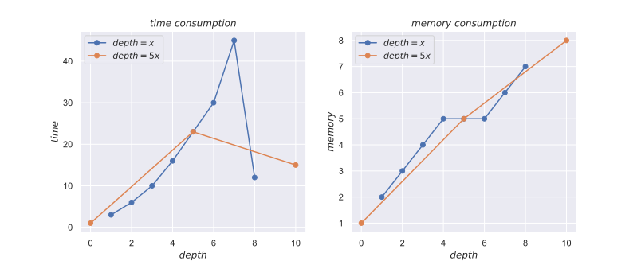
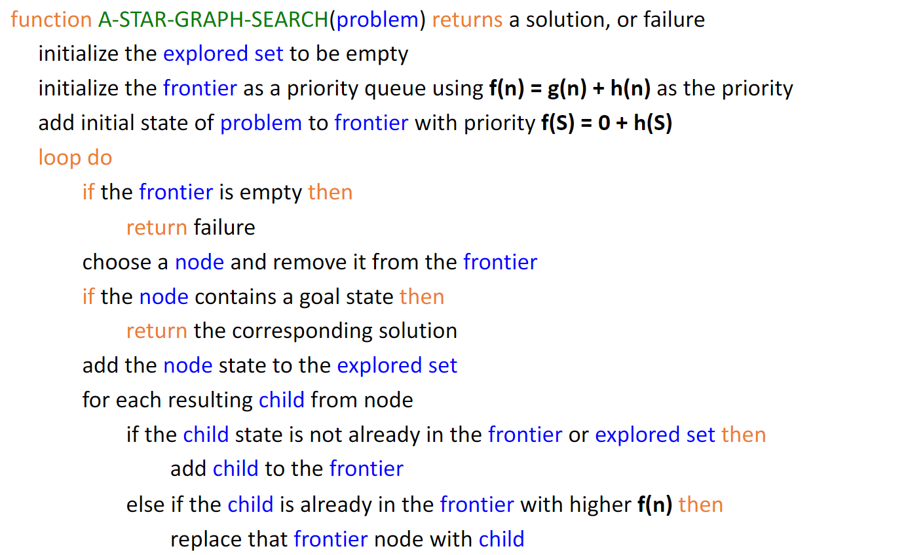
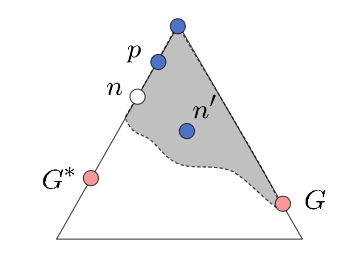

# Lab2

### Exercise 1

**A. Number of 'Lakes'**

For each explored `%`, I use DFGS to find all the adjacent `%`, increase the number of lakes by 1 and mark all the adjacent `%` as explored.

**B. DFGS with Iterative Deepening**

**Announcement**: As the actual running time and memory consumption of program is relative small, it would largely affected by operating system's status. Thus, I use the <u>number of `while` loop</u> to represent time consumption and use the <u>maximum size of `Stack`</u> to represent memory consumption.

I choose $\text{depth}=x$ and $\text{depth}=5x$ as two increasing functions. Their performances are as follows:

Analysis:

- For function `depth=x`

  It increases depth step by step cautiously. Thus, it spends more time in reaching the correct depth. However, it manages to consume as little memory as possible. 

- For function `depth=5x` 

  It increases depth using giant step. Thus, it is more time-efficient as it can reach the correct depth more quickly. However, since the final search depth may exceed the correct one, it would consume more memory and might yield a suboptimal answer.

Conclusion: The increasing function should increase quickly while it should not exceed the correct depth too much.

### Exercise 2

**Announcement**: I use the <u>size of `explored`</u> to represent time consumption.

**Announcement**: If two items have equal `h` value in priority queue, I prefer the one with higher `g` value to break the tie.

I mainly follow the framework provided in slides to implement UCGS, GGS and A*GS. 

- GGS wins in `Maze_lab2_2_1.lay`

  Both UCGS and GGS yield the correct answer `cost = 17`. However, `len(explored)` of GGS is only 19 while `len(explored)` of UCGS is 81

- UCGS wins in `Maze_lab2_3_1.lay`

  UCGS yields the correct answer `cost = 17` while GGS yields a suboptimal answer `cost = 21`

Conclusion:

- If heuristic close to the reality, GGS runs faster and correctly.
- However, if heuristic diverges a lot from reality, for example when goal is partially blocked, GGS would slow down and may yield a suboptimal answer.

UCGS drawbacks: UCGS is fair but kind of short sighted. There are no bias over all the current solutions, which means it moves step by step and does not seeks for some potential best solutions.

### Exercise 3

**Announcement**: If two items have equal `h` value in priority queue, I prefer the one with higher `g` value to break the tie.

I mainly follow the framework provided in slides to implement A*GS.

Experiment results of UCGS, GGS and A*GS:

| cost (17 is optimal) | UCGS | GGS  | A*GS |
| -------------------- | ---- | ---- | ---- |
| Maze_lab2_2_1.lay    | 17   | 17   | 17   |
| Maze_lab2_3_1.lay    | 17   | 21   | 17   |

| # nodes (contains start node) | UCGS | GGS  | A*GS |
| ----------------------------- | ---- | ---- | ---- |
| Maze_lab2_2_1.lay             | 81   | 19   | 65   |
| Maze_lab2_3_1.lay             | 71   | 30   | 55   |

Heuristic using Manhattan Distance is better.
$$
M(P,G)=\left|x_{P}-x_{G}\right|+\left|y_{P}-y_{G}\right|
$$

- Theoretically

  Manhattan Distance is admissible and consistency which ensures the correctness.

  Besides, Euclidean distance < Manhattan Distance <= real cost. Thus, Manhattan Distance is more accurate.

- Experimentally

  | # nodes           | Euclidean distance | Manhattan Distance |
  | ----------------- | ------------------ | ------------------ |
  | Maze_lab2_2_1.lay | 65                 | 18                 |
  | Maze_lab2_3_1.lay | 55                 | 18                 |

**Analysis of new heuristic function**
$$
\operatorname{dis}(P, G)=\left|x_{P}-x_{G}\right|+\left|y_{P}-y_{G}\right|-\mathbb{I}\left\{\left|x_{P}-x_{G}\right| \neq\left|y_{P}-y_{G}\right|\right\}
$$
This heuristic is not consistent, but A*GS still works correctly. The proof are as follows:

For any n on path to G*, let n' be a worse node for the same state.

Let p be the ancestor of n that was on the queue when n' was added in the queue.

As the problem has <u>grid structure</u>, we have:
$$
g(n') \geq g(n) +2
$$
Let us denote Manhattan Distance as $M(P,Q)$. Though this heuristic function is not consistent, it still ensures that $h(n)\leq M(n,g)$ and $h(n) +1 \geq M(n,g)$. Then, we have
$$
\begin{align*}
f(p)&=g(p)+h(p) \\
&\leq g(p) + M(p,g) \\
&\leq g(p) +M(p,n)+M(n,g) \\
&\leq g(p) + M(p,n) + h(n) +1\\
&\leq g(n)+h(n)+1 =f(n)+1 \\
\end{align*}
$$
Combined with the property of grid structure, we have:
$$
\Rightarrow f(n') \geq f(n) +2 \geq f(p)+1 \\
f(n') >f(p)
$$
Claim: p will be expanded before n'

