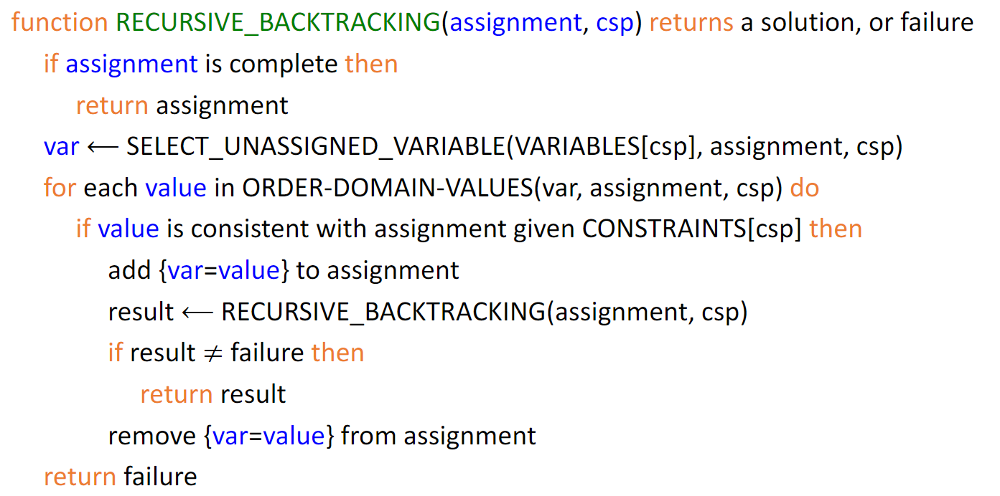

# Lab3

### Exercise 1

1. Implementation of `_classroom_conflict()`

   2 students are conflict only when they are adjacent and they are friends.

   **Beside**,  a student can not sit at 2 seats. To maintain the generalization of `backtracking()`, I add this check in `nconflicts()`

   ```python
   return count(conflict(v) for v in self.neighbors[var]) + \
   	len(assignment.values()) - len(set(assignment.values()))
   ```

2. Implementation of `backtracking()`

   I mainly follow the framework provided in slides.

   


### Exercise 2

1. Implementation of `forward_checking()` 

   Forward_checking cross off values that violate some constraints with current assigned variable.

2. Implementation of `AC3`

   I use `queue` instead of `set` to implement AC3. Meanwhile, I only use a subset of the arcs to initialize the queue. 

3. Implementation of `backtracking_with_inference()`

   I mainly follow the framework provided in slides.
   
   
   
4. Different strategies for sudoku problem.

   Since `argmin_random_tie` is invoked, results may vary.

   For easy case, 

   |         | # backtracking | runtime |
   | ------- | -------------- | ------- |
   | **fc**  | 0              | ~0.01s  |
   | **AC3** | 0              | ~0.08s  |

   For hard case,

   |         | # backtracking | runtime |
   | ------- | -------------- | ------- |
   | **fc**  | ~150           | ~0.02s  |
   | **AC3** | ~50            | ~0.15s  |

   `AC3` can reduce the number of backtracking noticeably. However, as it takes much more time in each inference, it takes much more time than `fc` in solving sudoku problem. 


### Exercise 3

1. Implementation of `min_conflicts()`

   I implement random-restart. And it is able to solve 8-queens in ~10 random restarts.

2. `min_conflicts()` for Sudoku problems

   Experiments shows that 40 rounds of random-restart hill climbing is only able to find some suboptimal solution with ~25 conflicts. 

   It's quite hard (or maybe even impossible) for hill climbing algorithm to solve sudoku problem. Since sudoku problem is extremely non-convex and high dimension.
   
   