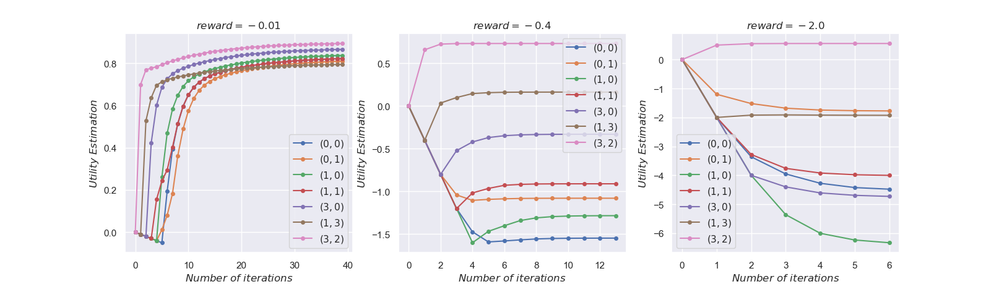
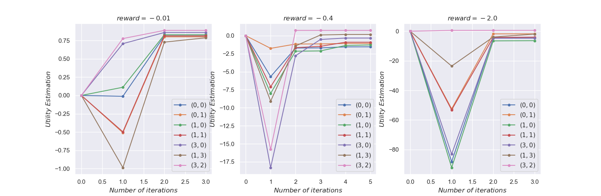

# Lab4

### Exercise 1

1. Implementation of `MinimaxAgent`

   I use `def search(depth, index, state)` as a helper function, where `depth` represents the depth of current search node and `index` indicates which agent (ghost) to move. `depth` increase by one after one Pacman move and all the ghosts' responses. `evaluationFunction`  is invoked when `search` function exceeds the depth limit or when the game is terminated (win/lose). 

   The complete code of `search` is as follows. Note that I also follow this framework to implement `AlphaBetaAgent` and `ExpectimaxAgent`.

   ```python
   def search(depth, index, state):
       if index == state.getNumAgents():
           return search(depth + 1, 0, state)
   
       if depth == self.depth or \
               state.isWin() or state.isLose():
           return self.evaluationFunction(state), None
   
       actions = state.getLegalActions(index)
       scores = []
       for action in actions:
           next_state = state.generateSuccessor(index, action)
           score, _ = search(depth, index + 1, next_state)
           scores.append(score)
   
       node_fn = max if index == 0 else min
       score = node_fn(scores)
       action_indices = [i for i in range(
           len(scores)) if scores[i] == score]
       action_index = random.choice(action_indices)
   
       return score, action_index
   ```

2. Implementation of `AlphaBetaAgent`

   In alpha-beta pruning, values of intermediate nodes might be wrong. Thus, I choose the first action when meeting tie.

   Besides, I use negate value trick to integrate alpha and beta prunes into one function. The core idea is to negate value of min (ghost) node and change them into max node (`min(values)=-max(-values)`). Additionally, [alpha, beta] domain changes correspondingly when it is passed through nodes with different types. Finally, all nodes become max node and there is no need to do alpha prune. Refer to code for more details.
   
3. Implementation of `ExpectimaxAgent`

   Change min (ghost) node into chance node that calculates average.

4. Implementation of `MinimaxGhost`

   Modify initial function call to `search(0, self.index, gameState)`.

**Experiments** under `testClassic` layout

| Win rate \| Score                | Random ghosts      | Minimax ghosts (with depth 2) |
| -------------------------------- | ------------------ | ----------------------------- |
| Minimax Pacman (with depth 4)    | 552/1000 \|  44.58 | 522/1000 \|  14.65            |
| Expectimax Pacman (with depth 4) | 640/1000 \| 130.26 | 522/1000 \|  13.86            |

- Minimax agent is conservative when facing random ghosts, as it only considers the worst situation. However, it maintains good performance even when facing minimax ghosts.

- Expetimax agent can better predict random ghosts and wins more scores. However, it is too optimistic when facing minimax ghosts.

- The key to get more scores is to build an accurate model of opponent.

  

### Exercise 2

$$
\begin{aligned}
&V_{k+1}(s)=\max _{a} Q_{k}(s, a) \\
&Q_{k}(s, a)=\sum_{s^{\prime}} T\left(s, a, s^{\prime}\right)\left[R\left(s, a, s^{\prime}\right)+\gamma V_{k}\left(s^{\prime}\right)\right] 
\end{aligned}
$$



The convergence results are as following:

```
-0.01				-0.4				-2.0
N > ^ .				N > > .				N > > .
. v . >				. ^ . ^				. > . ^
v v N ^				^ ^ N ^				^ ^ N ^
> > > ^				^ > > ^				^ ^ > ^
```

Findings

- When reward = -0.01, the agent is conservative as it is cheap to take more actions. Thus, It prefers those actions that ensure safety, which lead agent to bump into wall and hope to go at right angles by chance.
- When reward = -0.4, the agent has to take the risk of accidentally heading into `-1` to reduce steps.
- When reward = -2.0, the agent just gives up and only wants to finish as soon as possible.
- In this case, VI converges faster when reward is more negative.


### Exercise 3



As PI and VI can both find optimal solution, the convergence results of PI and the optimal policies found by PI are exactly the same as what found by VI.

Findings

- Same findings as in Exercise 2.

- PI converges faster than VI.
