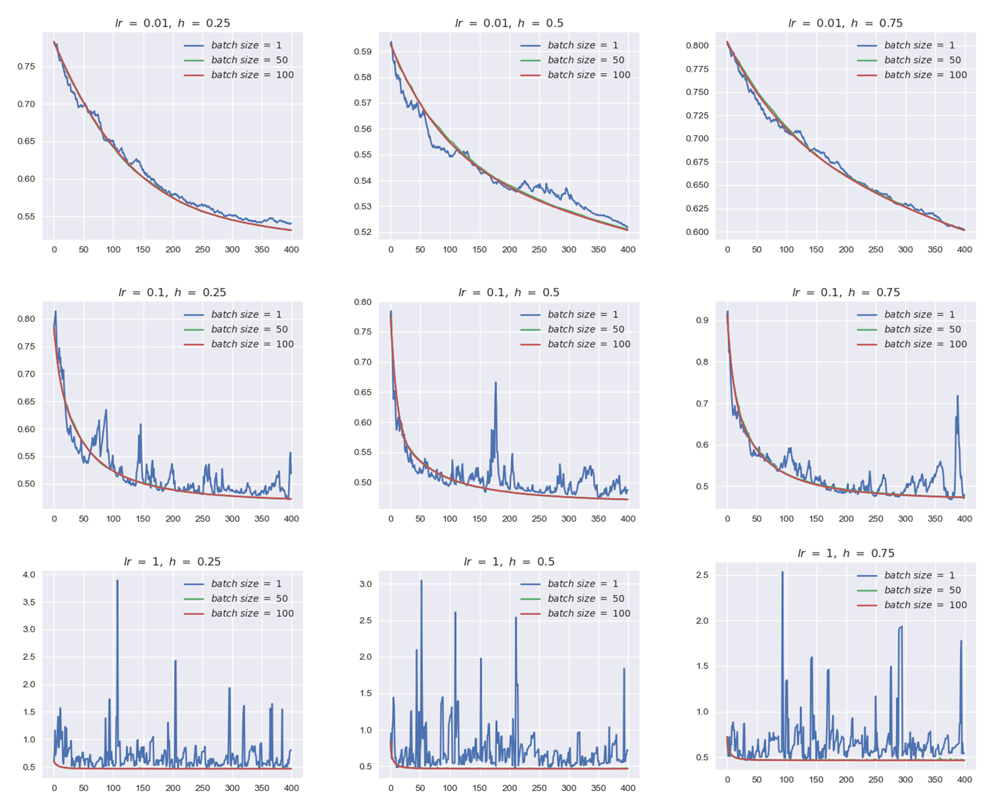
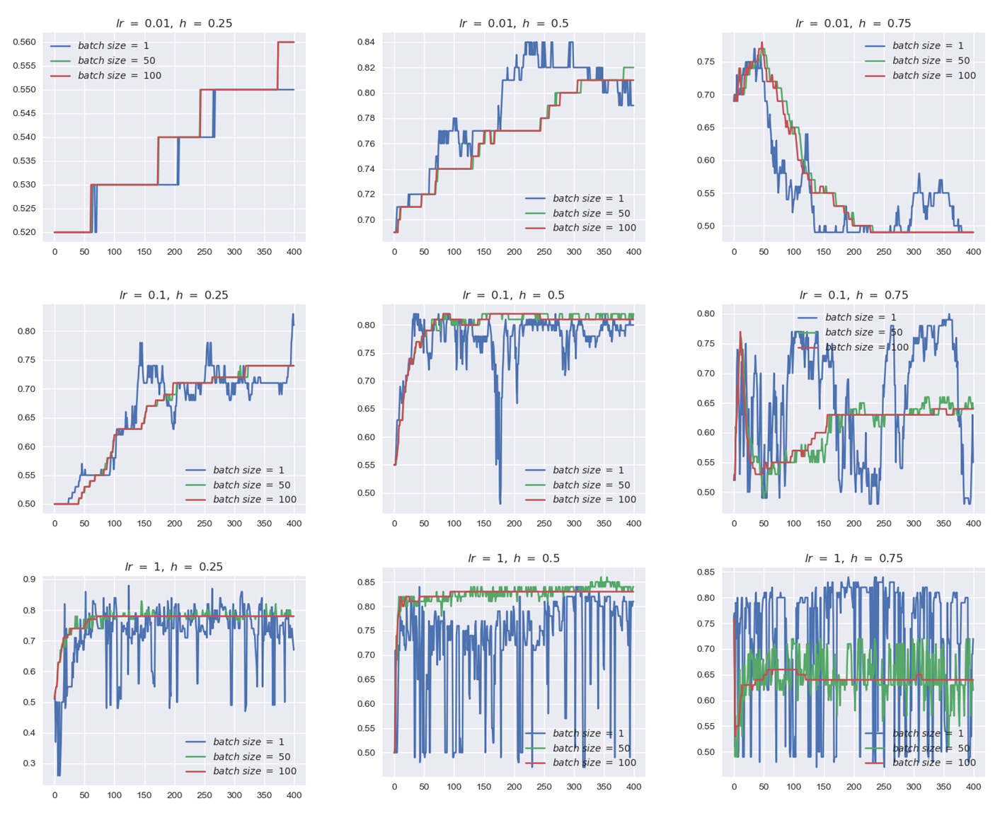
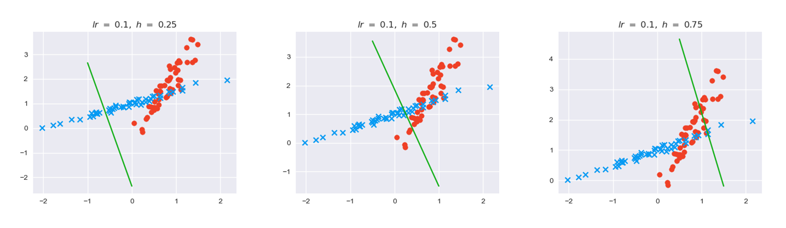
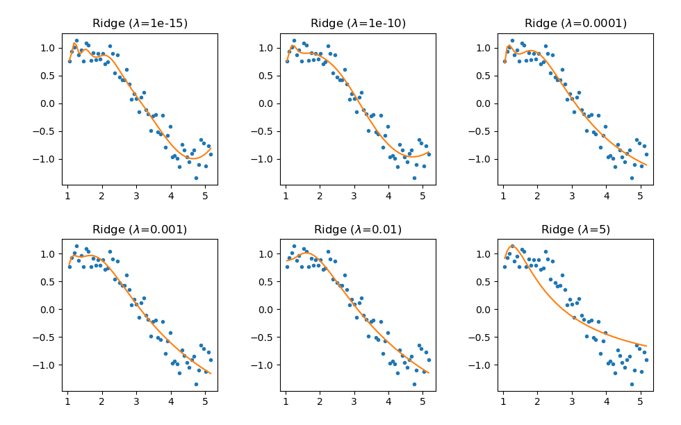
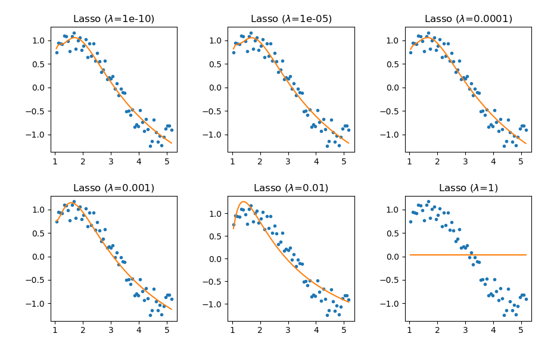
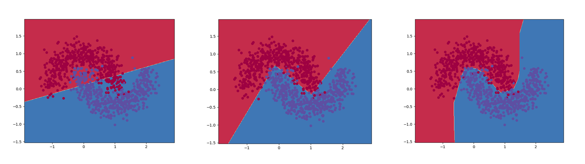

# Lab5

### Exercise 1

Run `P1.py` to get $\hat Y$.

To verify the aforementioned geometric interpretation, we denote 
$$
Y_{\perp}=\hat Y-Y
$$
As $\hat Y$ is the projection of $Y$, $Y_{\perp}$ should be perpendicular with all the column vectors in $X$ and I verify this in `P1.py`.

### Exercise 2

1. Impact of learning rate, batch size and thresholds

   

   

   - learning rate

     Small $\eta$ leads slow convergence while large $\eta$ might overshoot the minimum and fail to converge.

     When `lr=0.01`, accuracy increase and loss decrease are relatively slow.

     When `lr=1`, loss and accuracy are unstable.

   - batch size

     As is illustrated in the above figures, SGD is unstable and leads thrashing, while mini-batch gradient descent and (batch) gradient descent are stable and easier to converge.

   - thresholds

     Different values of thresholds have no impact of loss. They only influence precision and recall.

     As accuracy is a mixture of precision and recall, either higher or lower thresholds lead to accuracy decrease.

     

2. Impact of thresholds

   

   - Higher threshold

     More false-negative and less false-positive. Higher precision. Lower recall.

   - Lower threshold

     More false-positive and less false-negative. Lower precision. Higher recall.

### Exercise 3

1. L2 regularization is less computationally expensive. L1 regularization makes the objective function undifferentiable at some points and increases the complexity to find the optimal solution.
2. L1 regularization tends to create a sparse output.
3. Proper regularization can avoid overfitting and increase generalizability.

### Exercise 4

Larger number of hidden neurons increase the non-linearity of decision boundary and increase the classification ability of model.
